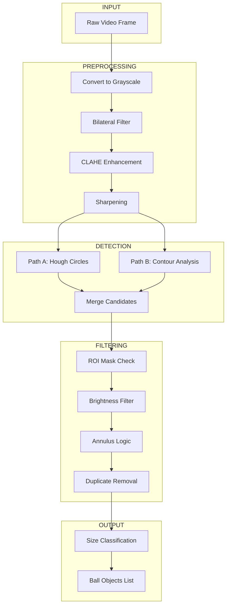

# 🎯 Bead Detection System – Presentation Guide

This document will help you deeply understand and present the slides about your bead detection system. Each section explains the concepts in simple terms with references to the actual code.

---

## 📋 Quick Navigation

| Section | Topic |
|---------|-------|
| [Foundational Concepts](#-foundational-concepts-glossary) | Terms you need to know |
| [File Responsibilities](#-file-responsibilities) | What each code file does |
| [The Problem We're Solving](#-the-problem-were-solving) | Why we built this system |
| [How The Algorithm Works](#-how-the-algorithm-works-step-by-step) | Deep dive into detection |
| [Problems We Faced & Solutions](#-problems-we-faced--how-we-solved-them) | Technical challenges |
| [Slide-by-Slide Guide](#️-slide-by-slide-guide) | Key points for each slide |
| [Speech Script](#-speech-script) | What to say during presentation |
| [Q&A Section](#-qa-possible-questions-and-answers) | Possible questions and answers |

---

# 📚 Foundational Concepts (Glossary)

Before diving into the algorithm, let's understand the key terms you'll use in your presentation.

---

## 🔵 Radius vs Radii

**Radius** (singular): The distance from the center of a circle to its edge.

**Radii** (plural): Multiple radii. When we talk about "radii" in our code, we mean the radius measurements of multiple circles.

```
       radius
    ←─────────→
    
        ●──────○  ← center to edge = radius
       /       
      /        
     ●─────────○  ← another radius
     
    These are "radii" (plural)
```

In our code:
```python
# Single circle has a radius
ball.r_px = 15  # radius in pixels

# When we talk about all detected beads, we have multiple radii
for ball in balls:
    print(ball.r_px)  # prints each radius
```

---

## 🎬 What is PyAV?

**PyAV** is a Python library that wraps **FFmpeg** (the most powerful video processing tool).

### Why PyAV instead of OpenCV?

| Feature | OpenCV (`cv2.VideoCapture`) | PyAV |
|---------|----------------------------|------|
| Seeking accuracy | ❌ Imprecise (lands on keyframes) | ✅ Frame-perfect (uses PTS) |
| Codec support | Limited | All FFmpeg codecs |
| Metadata access | Basic | Full (rotation, timestamps) |
| Performance | Good | Excellent (multi-threaded) |

### Simple Example:
```python
import av

# Open video file
container = av.open("video.mp4")

# Get video stream
stream = container.streams.video[0]

# Decode frames
for frame in container.decode(stream):
    image = frame.to_ndarray(format='bgr24')
```

**Think of it as**: PyAV is like having FFmpeg's full power available in Python code.

---

## 🔄 What is Multi-Threading?

**Threading** = Running multiple tasks at the same time.

### Single-Threaded (Sequential):
```
Task A: [████████████]
                      Task B: [████████████]
                                            Task C: [████████]
Total time: ████████████████████████████████████████
```

### Multi-Threaded (Parallel):
```
Task A: [████████████]
Task B: [████████████]
Task C: [████████]
Total time: ████████████  ← Much faster!
```

### How We Use It:

In our code, PyAV uses multi-threading for **video decoding**:

```python
# From playback.py
self.stream.thread_type = 'AUTO'  # Enable multi-threaded decoding
```

This means:
- **Main thread**: Runs our Python code
- **Decoder threads**: FFmpeg decodes video frames in parallel

**Result**: Video loading is 2-4× faster than single-threaded.

**Analogy**: Like a restaurant with multiple chefs cooking different dishes at the same time, instead of one chef cooking everything sequentially.

---

## 📄 JSON vs JSONL (JSON Lines)

### JSON (JavaScript Object Notation):
A format to store structured data. **One big object/array per file**.

```json
{
  "frames": [
    {"frame_id": 0, "balls": [...]},
    {"frame_id": 1, "balls": [...]},
    {"frame_id": 2, "balls": [...]}
  ]
}
```

**Problem**: To add a new frame, you must:
1. Read the entire file
2. Parse the whole JSON
3. Add the new item
4. Rewrite the entire file

For large files, this is SLOW and uses lots of memory!

### JSONL (JSON Lines):
**One JSON object per line**. Each line is independent.

```jsonl
{"frame_id": 0, "balls": [...]}
{"frame_id": 1, "balls": [...]}
{"frame_id": 2, "balls": [...]}
```

**Advantage**: To add a new frame:
```python
with open("detections.jsonl", "a") as f:  # "a" = append mode
    f.write(json.dumps(new_frame) + "\n")  # Just add one line!
```

No need to read or rewrite the existing content!

| Feature | JSON | JSONL |
|---------|------|-------|
| Add new data | Rewrite entire file | Append one line |
| Read partial data | Must parse whole file | Read line by line |
| Memory usage | High (load all) | Low (stream) |
| Human readable | Yes | Yes |
| Resume interrupted processing | Hard | Easy |

**We use JSONL** because during detection, we process thousands of frames and save each one immediately. If the process crashes, we don't lose all progress!

---

## ⏱️ FPS and Milliseconds Explained

### What is FPS (Frames Per Second)?

**FPS** = How many images (frames) are shown every second.

```
30 FPS = 30 images shown in 1 second
60 FPS = 60 images shown in 1 second (smoother!)
```

### The Math: FPS to Milliseconds

To display at a certain FPS, each frame has a **time budget**:

```
Time per frame (ms) = 1000ms / FPS

30 FPS → 1000 / 30 = 33.3ms per frame
60 FPS → 1000 / 60 = 16.6ms per frame
```

### Our Problem:

```
Detection takes:     50-100ms per frame
30 FPS requires:     33.3ms per frame
                     ↓
We're 2-3× TOO SLOW for real-time!
```

### Visual Comparison:

```
┌─────────────────────────────────────────────────────────┐
│ WHAT 30 FPS NEEDS:                                      │
│                                                         │
│ 1 second = 1000ms                                       │
│ ├──┼──┼──┼──┼──┼──┼──┼──┼──┼──┼──┼──┼──┼──┼──┤...      │
│   33ms each (30 frames fit in 1 second)                 │
└─────────────────────────────────────────────────────────┘

┌─────────────────────────────────────────────────────────┐
│ WHAT OUR DETECTION DOES:                                │
│                                                         │
│ 1 second = 1000ms                                       │
│ ├────────┼────────┼────────┼────────┼────────┤...      │
│   100ms each (only 10 frames fit = 10 FPS, too slow!)   │
└─────────────────────────────────────────────────────────┘
```

### Our Solution: Two-Phase Architecture

**Phase 1**: Process offline (doesn't matter how slow)
**Phase 2**: Playback only needs ~8ms per frame (well under 16.6ms for 60 FPS)

```
Playback breakdown:
├── Decode frame:     ~5ms
├── Read from cache:  ~1ms
├── Draw overlays:    ~2ms
└── Total:            ~8ms ✅ (under 16.6ms budget)
```

---

## 🎯 Why Lower `hough_param2` = More Circles?

### What is `hough_param2`?

It's the **accumulator threshold** for the Hough Circle detector.

### How Hough Works (Simplified):

1. For each edge pixel, the algorithm "votes" for possible circle centers
2. An **accumulator array** counts votes for each possible center
3. `param2` is the **minimum votes** needed to be considered a circle

```
           Accumulator (votes for each position)
           
           5   8   12  15  8   3
           10  18  25  30  22  8     ← Numbers = votes
           8   22  45  52  35  10
           6   15  30  38  28  9
           
           param2 = 50 → Only "52" is detected (1 circle)
           param2 = 30 → "52", "45", "38", "35", "30" detected (many circles!)
```

### The Trade-off:

| `hough_param2` | Effect | Result |
|----------------|--------|--------|
| **Higher (e.g., 50)** | Need more votes | Fewer circles, only strong ones |
| **Lower (e.g., 20)** | Need fewer votes | More circles, including weak/false ones |

### In Our Code:

```python
# Default value
self.hough_p2 = config.get('vision', {}).get('hough_param2', 20)

# For blurry frames, we INCREASE it to avoid false positives
adaptive_param2 = self.hough_p2 + (5 if is_blurry_frame else 0)
```

We use **20** (relatively low) because:
- Beads overlap and are partially hidden
- We'd rather detect too many and filter later
- Our filtering steps (brightness, annulus) remove false positives

---

# 📁 File Responsibilities

Each file in our codebase has a specific job. Here's what each one does:

## Core Files

### [orchestrator.py](file:///c:/Users/guilh/OneDrive/Área de Trabalho/ColorCodingTest/src/mill_presenter/core/orchestrator.py) – **The Coordinator**

**Job**: Connects all the pieces and runs the detection pipeline.

```
┌─────────────────────────────────────────────────┐
│                 ORCHESTRATOR                    │
│                                                 │
│   ┌─────────┐    ┌───────────┐    ┌───────┐   │
│   │ Frame   │ →  │  Vision   │ →  │ Cache │   │
│   │ Loader  │    │ Processor │    │       │   │
│   └─────────┘    └───────────┘    └───────┘   │
│                                                 │
│   + Progress reporting                          │
│   + Cancellation handling                       │
│   + ROI mask application                        │
└─────────────────────────────────────────────────┘
```

**Key responsibilities**:
1. Read frames from `FrameLoader`
2. Pass each frame to `VisionProcessor`
3. Save results to `ResultsCache`
4. Report progress (0-100%)
5. Handle cancellation if user stops

---

### [processor.py](file:///c:/Users/guilh/OneDrive/Área de Trabalho/ColorCodingTest/src/mill_presenter/core/processor.py) – **The Brain**

**Job**: The actual computer vision logic. Takes an image, returns detected beads.

```
Input: Raw video frame (numpy array)
                ↓
┌─────────────────────────────────────┐
│           VISION PROCESSOR          │
│                                     │
│  1. Preprocess (Bilateral, CLAHE)   │
│  2. Detect (Hough + Contours)       │
│  3. Filter (Brightness, Annulus)    │
│  4. Classify (pixels → mm → size)   │
│                                     │
└─────────────────────────────────────┘
                ↓
Output: List of Ball objects with (x, y, radius, size_class)
```

**This is where all the "magic" happens!**

---

### [overlay.py](file:///c:/Users/guilh/OneDrive/Área de Trabalho/ColorCodingTest/src/mill_presenter/core/overlay.py) – **The Artist**

**Job**: Draw colored circles on video frames.

```
Input: Detection results + visible size classes
                ↓
┌─────────────────────────────────────┐
│          OVERLAY RENDERER           │
│                                     │
│  For each detected ball:            │
│    - Check if size class is visible │
│    - Get color for that size        │
│    - Draw circle at (x, y) with r   │
│                                     │
└─────────────────────────────────────┘
                ↓
Output: Circles drawn on the QPainter
```

**Key optimization**: Pre-allocates `QPen` objects to avoid creating new ones every frame.

---

### [playback.py](file:///c:/Users/guilh/OneDrive/Área de Trabalho/ColorCodingTest/src/mill_presenter/core/playback.py) – **The Video Reader**

**Job**: Open video files and extract frames with PyAV.

**Key features**:
- Frame-accurate seeking using PTS
- Rotation metadata handling (for iPhone/Nikon videos)
- Multi-threaded decoding

---

### [cache.py](file:///c:/Users/guilh/OneDrive/Área de Trabalho/ColorCodingTest/src/mill_presenter/core/cache.py) – **The Memory**

**Job**: Save and load detection results.

**Two-layer storage**:
1. **Disk**: JSONL file (persistent, survives restart)
2. **RAM**: Python dictionary (fast O(1) lookup during playback)

---

## Summary Table

| File | One-Line Description |
|------|---------------------|
| `orchestrator.py` | Coordinates the pipeline: loader → processor → cache |
| `processor.py` | Computer vision: image → detected beads |
| `overlay.py` | Drawing: detection results → colored circles |
| `playback.py` | Video I/O: video file → frames |
| `cache.py` | Storage: detection results ↔ JSONL file + RAM |
| `main_window.py` | UI: buttons, slider, video display |

---

# 🎯 The Problem We're Solving

## The Real-World Scenario

Imagine a **small ball mill** – a rotating drum filled with metallic beads of different sizes (4mm, 6mm, 8mm, 10mm). These beads grind materials by tumbling inside the drum.

**Our goal**: Build software that can:
1. Watch a video of the drum rotating
2. **Detect every bead** in each frame
3. **Classify each bead by size** (4/6/8/10mm)
4. **Display colored circles** over the video showing the bead sizes
5. Allow **smooth, lag-free playback** with instant scrubbing

## Why Is This Hard?

| Challenge | Why It's Difficult |
|-----------|-------------------|
| **Beads are metallic** | Shiny surfaces create glare and reflections that confuse detectors |
| **Beads are hollow rings** | The inner hole looks like another bead! |
| **Beads overlap and pile up** | Hard to see individual bead edges |
| **Video is long (thousands of frames)** | Can't process in real-time; too slow |
| **User expects smooth playback** | Must run at 60 FPS with overlays |

---

# 🧠 How The Algorithm Works (Step-by-Step)

This is the heart of the system. Let's walk through exactly what happens when we process a video frame.

## The Complete Pipeline



---

## Step 1: Preprocessing – Prepare the Image

### Why We Need Preprocessing

The raw camera image has problems:
- **Glare spots** from lights reflecting off metallic beads
- **Dark shadows** where beads are hard to see
- **Noise** from camera sensor

We fix these with 4 operations:

### 1.1 Convert to Grayscale

```python
gray = cv2.cvtColor(frame_bgr, cv2.COLOR_BGR2GRAY)
```

**Why?** Circle detection algorithms work on intensity (brightness), not color. Converting to grayscale simplifies the data from 3 channels (R,G,B) to 1 channel.

### 1.2 Bilateral Filter – Smart Blurring

```python
filtered = cv2.bilateralFilter(gray, 9, 75, 75)
```

**The Problem**: Glare creates bright spots that look like edges.

**How Bilateral Filter Works**:

```
Normal Blur:                    Bilateral Filter:
┌─────────────┐                 ┌─────────────┐
│ ░░░░░░░░░░░ │                 │ ░░░░░░░░░░░ │
│ ░░██████░░░ │  Blurs edge →   │ ░░░░░░░░░░░ │
│ ░░██████░░░ │                 │ ░░██████░░░ │  Keeps edge sharp!
│ ░░░░░░░░░░░ │                 │ ░░██████░░░ │
└─────────────┘                 └─────────────┘
```

**Key insight**: Bilateral filter looks at **two things**:
1. **Spatial distance** – how far apart are the pixels?
2. **Intensity difference** – how different are the brightness values?

It only averages pixels that are **BOTH close AND similar in brightness**. This smooths out noise WHILE keeping sharp edges (like bead outlines).

### 1.3 CLAHE – Contrast Enhancement

```python
clahe = cv2.createCLAHE(clipLimit=2.0, tileGridSize=(8,8))
enhanced = clahe.apply(filtered)
```

**The Problem**: Some beads are in shadows, making their edges nearly invisible.

**How CLAHE Works**:

```
BEFORE:                          AFTER CLAHE:
┌─────────────────────┐          ┌─────────────────────┐
│ BRIGHT ░░░░░ DARK   │          │ BRIGHT ████ DARK    │
│ AREA   ░░░░░ AREA   │    →     │ AREA   ████ AREA    │
│ ░░░░░░ ░░░░░ ░░░░░░ │          │ ████░░ ████ ░░████  │
└─────────────────────┘          └─────────────────────┘
                                  (contrast boosted locally)
```

**C**ontrast **L**imited **A**daptive **H**istogram **E**qualization:
1. Splits the image into 8×8 **tiles**
2. In each tile, stretches the contrast independently
3. **"Clip limit"** prevents over-enhancement (avoids making noise worse)

**Analogy**: Like HDR photography – brings out detail in shadows without blowing out highlights.

### 1.4 Sharpening – Enhance Edges

```python
gaussian = cv2.GaussianBlur(enhanced, (0, 0), 3)
sharpened = cv2.addWeighted(enhanced, 1.5, gaussian, -0.5, 0)
```

**How It Works** (Unsharp Mask):
1. Make a blurred copy of the image
2. Subtract the blurred version from the original
3. The **difference** = edges!
4. Add this edge-enhanced version back to the original

**Formula**: `sharpened = original × 1.5 - blurred × 0.5`

---

## Step 2: Detection – Find Circle Candidates

Now we have a clean, contrast-enhanced image. Time to find circles!

### Why Two Detection Methods?

Neither method alone is perfect:

| Scenario | Hough Circles | Contour Analysis |
|----------|---------------|------------------|
| Beads piled together, overlapping | ✅ Great | ❌ Edges broken |
| Single bead flying in air | ❌ Too noisy | ✅ Perfect |
| Partial bead at edge of frame | ❌ Needs full circle | ✅ Can detect partial |

**We use BOTH and merge the results!**

### Path A: Hough Circle Transform

```python
circles = cv2.HoughCircles(
    detection_img,
    cv2.HOUGH_GRADIENT,
    dp=1,
    minDist=15,          # Minimum 15px between circle centers
    param1=50,           # Canny edge threshold
    param2=20,           # Accumulator threshold (lower = more sensitive)
    minRadius=min_r,     # Based on smallest bead size
    maxRadius=max_r      # Based on largest bead size
)
```

**How Hough Transform Works (Deep Explanation)**:

Think of it as a **voting system**:

```
1. For each EDGE pixel in the image:
   
   [Image with edges]        [Accumulator Space]
   ┌─────────────┐           ┌─────────────┐
   │     ●●●     │           │             │
   │   ●     ●   │    →      │             │
   │   ●     ●   │           │             │
   │     ●●●     │           │             │
   └─────────────┘           └─────────────┘
   
2. For each edge pixel, imagine ALL circles of ALL radii
   that could pass through this point:
   
   [Edge pixel at (5,3)]     [Votes in accumulator]
        ↓                    ┌─────────────┐
        ●  ←─ circles of     │  ○ ○ ○ ○    │ ← Each possible
           different radii   │ ○       ○   │   center gets +1 vote
           pass through      │○         ○  │
           this pixel        │ ○       ○   │
                             └─────────────┘

3. Repeat for all edge pixels. The center of the REAL circle
   gets the MOST votes because ALL edge pixels vote for it:
   
   [Final Accumulator]
   ┌─────────────┐
   │             │
   │      ★      │  ← Peak = 100 votes = circle center found!
   │             │
   └─────────────┘
```

**Parameters explained**:
- `dp=1`: Full resolution accumulator (most accurate)
- `minDist=15`: Don't detect two circles within 15 pixels (prevents duplicates)
- `param1=50`: Canny edge detector high threshold
- `param2=20`: Minimum votes needed to be considered a circle (lower = more sensitive)

### Path B: Contour Analysis

```python
# 1. Find edges with Canny
edges = cv2.Canny(detection_img, low_thresh, high_thresh)

# 2. Close small gaps in edges
kernel = cv2.getStructuringElement(cv2.MORPH_ELLIPSE, (3, 3))
closed_edges = cv2.morphologyEx(edges, cv2.MORPH_CLOSE, kernel)

# 3. Find closed shapes (contours)
contours, _ = cv2.findContours(closed_edges, cv2.RETR_EXTERNAL, cv2.CHAIN_APPROX_SIMPLE)

# 4. For each contour, check if it's circular
for cnt in contours:
    area = cv2.contourArea(cnt)
    perimeter = cv2.arcLength(cnt, True)
    circularity = 4 * np.pi * area / (perimeter * perimeter)
    
    if circularity > 0.65:  # Circle = 1.0, Square ≈ 0.78
        (x, y), r = cv2.minEnclosingCircle(cnt)
        # Add to candidates!
```

**How Contour Analysis Works**:

```
Step 1: Canny Edge Detection
┌─────────────┐    ┌─────────────┐
│  ○          │ →  │  ╭──╮       │
│             │    │  │  │       │
│             │    │  ╰──╯       │
└─────────────┘    └─────────────┘
   (original)        (edges only)

Step 2: Close gaps (morphology)
┌─────────────┐    ┌─────────────┐
│  ╭-─╮       │ →  │  ╭──╮       │
│  │  │       │    │  │  │       │
│  ╰-─╯       │    │  ╰──╯       │
└─────────────┘    └─────────────┘
  (broken edge)     (closed edge)

Step 3: Find contours & check circularity
    
    Circularity = 4π × Area / Perimeter²
    
    ○ Circle:  4π × πr² / (2πr)² = 1.0  ← Perfect!
    □ Square:  4π × s² / (4s)² = 0.78   ← Not circular
    ▽ Triangle: Even lower              ← Rejected
```

---

## Step 3: Filtering – Remove False Positives

We now have a list of circle candidates from both detectors. But many are **false positives**! We filter them out:

### 3.1 ROI Mask Check

```python
if roi_mask is not None:
    if roi_mask[y, x] == 0:  # If center is in masked area
        continue  # Skip this candidate
```

**Purpose**: Only detect beads inside the drum opening. Ignore everything outside.

### 3.2 Brightness Filter – Reject Dark Holes

```python
center_patch = gray[y-2:y+3, x-2:x+3]  # 5x5 patch at center
avg_brightness = np.mean(center_patch)

if avg_brightness < 25:  # Very dark = background hole
    continue
```

**The Problem**: The drum's back plate has dark holes that look circular!

```
┌────────────────────┐
│   ●●● DRUM ●●●     │
│   ●●●      ●●●     │ ← Real beads (shiny, bright centers)
│ ○ ○ ○ HOLES ○ ○ ○  │ ← Background holes (dark, shadowy)
└────────────────────┘
```

**The Fix**: Real beads are metallic = reflective = bright centers. Holes are dark. Check brightness!

### 3.3 Annulus Logic – Reject Inner Holes of Hollow Beads

```python
for (fx, fy, fr, _) in final_candidates:
    dist = np.sqrt((x - fx)**2 + (y - fy)**2)
    
    # If this circle's center is INSIDE another circle
    # AND this circle is MUCH smaller
    if dist < (fr * 0.3) and r < (fr * 0.5):
        is_hole = True
        break
```

**The Problem**: Beads are hollow rings (annulus shape). Detectors find BOTH:

```
      What we see:              What detectors find:
    ┌─────────────┐            ┌─────────────┐
    │   █████     │            │   █████     │ ← Outer rim = BIG circle
    │  █     █    │     →      │  █  ○  █    │ ← Inner hole = SMALL circle
    │  █     █    │            │  █     █    │
    │   █████     │            │   █████     │
    └─────────────┘            └─────────────┘
    
    We want: 1 bead     We get: 2 circles (wrong!)
```

**The Fix**: If a small circle is centered inside a big circle → reject the small one!

### 3.4 Non-Maximum Suppression (NMS) – Remove Duplicates

```python
for (fx, fy, fr, _) in final_candidates:
    dist = np.sqrt((x - fx)**2 + (y - fy)**2)
    combined_r = (r + fr) / 2
    
    # If centers are VERY close AND radii are similar → duplicate
    if dist < (combined_r * 0.4) and abs(r - fr) < (combined_r * 0.25):
        is_duplicate = True
        break
```

**Purpose**: Both Hough and Contour might find the same bead. Remove duplicates!

---

## Step 4: Classification – Measure and Label

Now we have clean detections. Convert **pixels to millimeters** and assign size labels:

```python
# Convert radius in pixels to diameter in mm
diameter_mm = (2 * r_px) / self.px_per_mm

# Find the bin it belongs to
for bin_def in self.bins:
    if bin_def['min'] <= diameter_mm < bin_def['max']:
        return bin_def['label']  # Returns 4, 6, 8, or 10
```

**The Bins**:

| Label | Min (mm) | Max (mm) | Color in UI |
|-------|----------|----------|-------------|
| 4mm   | 3.0      | 5.0      | Configured  |
| 6mm   | 5.0      | 7.0      | Configured  |
| 8mm   | 7.0      | 9.0      | Configured  |
| 10mm  | 9.0      | 11.0     | Configured  |

**Critical**: `px_per_mm` must be calibrated correctly! We auto-detect the drum's outer edge (196mm) to calibrate.

---

# 🔧 Problems We Faced & How We Solved Them

## Problem 1: Real-Time Processing is Too Slow

**What we tried first**: Process each frame as the video plays.

**Why it failed**: Detection takes ~50-100ms per frame. At 30 FPS video, we could only achieve ~10 FPS playback – unwatchable!

**Our solution**: **Two-Phase Architecture**

```
BEFORE (Failed Approach):
┌─────────────────────────────────────────────┐
│ Play Frame 1 → Detect (100ms) → Display     │ 
│ Play Frame 2 → Detect (100ms) → Display     │  ← Too slow!
│ Play Frame 3 → Detect (100ms) → Display     │
└─────────────────────────────────────────────┘
Result: 10 FPS, laggy, unusable

AFTER (Working Solution):
Phase 1 (Offline):
┌─────────────────────────────────────────────┐
│ Process Frame 1 → Save to cache             │
│ Process Frame 2 → Save to cache             │  ← Takes time, but
│ Process Frame 3 → Save to cache             │     runs once!
│ ... (all frames)                            │
└─────────────────────────────────────────────┘

Phase 2 (Playback):
┌─────────────────────────────────────────────┐
│ Play Frame 1 → Load from cache → Display    │
│ Play Frame 2 → Load from cache → Display    │  ← 60 FPS!
│ Play Frame 3 → Load from cache → Display    │
└─────────────────────────────────────────────┘
```

**Code**: [cache.py](file:///c:/Users/guilh/OneDrive/Área de Trabalho/ColorCodingTest/src/mill_presenter/core/cache.py) – JSONL storage + RAM dictionary

---

## Problem 2: Metallic Beads Create Glare

**What we observed**: Bright white spots on beads from lights reflecting.

**Why it failed**: Edge detectors see glare edges as bead edges → wrong circles detected!

```
   Camera View:              Edge Detection:
┌─────────────┐           ┌─────────────┐
│    ★★★      │           │   ╭──╮╭──╮  │ ← Glare creates
│   ●●●●●     │    →      │  ╭╯○○╰╯○○╮ │   false edges!
│   ●●●●●     │           │  ╰──────╯  │
└─────────────┘           └─────────────┘
    (★ = glare)
```

**Our solution**: **Bilateral Filter**

```python
filtered = cv2.bilateralFilter(gray, 9, 75, 75)
```

This smooths out the glare spots while keeping the actual bead edge sharp.

**Code**: [processor.py line 46](file:///c:/Users/guilh/OneDrive/Área de Trabalho/ColorCodingTest/src/mill_presenter/core/processor.py#L46)

---

## Problem 3: Beads in Shadows Are Invisible

**What we observed**: Low-contrast areas where bead edges blend into the background.

**Why it failed**: Standard edge detection couldn't find edges with subtle brightness differences.

**Our solution**: **CLAHE (Adaptive Contrast Enhancement)**

```python
clahe = cv2.createCLAHE(clipLimit=2.0, tileGridSize=(8,8))
enhanced = clahe.apply(filtered)
```

This boosts contrast locally in 8×8 tile regions, bringing out detail in shadows.

**Code**: [processor.py lines 49-50](file:///c:/Users/guilh/OneDrive/Área de Trabalho/ColorCodingTest/src/mill_presenter/core/processor.py#L49-L50)

---

## Problem 4: Hollow Beads Detected Twice

**What we observed**: Each hollow bead counted as 2 circles (outer ring + inner hole).

**Why it failed**: Both Hough and Contour detect ANY circular pattern – including holes!

```
   Real Bead:              Detections:
┌─────────────┐         ┌─────────────┐
│   █████     │         │   █████     │
│  █     █    │   →     │  █ ●○  █    │ ← Two circles detected!
│  █     █    │         │  █     █    │   (outer and inner)
│   █████     │         │   █████     │
└─────────────┘         └─────────────┘
```

**Our solution**: **Annulus Logic**

```python
# If a small circle is centered inside a larger one → reject it
if dist < (fr * 0.3) and r < (fr * 0.5):
    is_hole = True
```

**Code**: [processor.py lines 172-186](file:///c:/Users/guilh/OneDrive/Área de Trabalho/ColorCodingTest/src/mill_presenter/core/processor.py#L172-L186)

---

## Problem 5: Background Holes Look Like Beads

**What we observed**: Dark circular holes in the drum's back plate detected as beads.

**Why it failed**: They're circular shapes → pass circle detection!

```
   Drum Interior:
┌────────────────────┐
│   ●●● BEADS ●●●    │ ← Bright, metallic
│                    │
│ ○ ○ ○ HOLES ○ ○ ○  │ ← Dark, shadowy (false positives!)
└────────────────────┘
```

**Our solution**: **Brightness Filter**

```python
avg_brightness = np.mean(center_patch)
if avg_brightness < 25:  # Very dark = hole
    continue  # Reject
```

Real beads are metallic = reflective = bright. Holes are dark shadows.

**Code**: [processor.py lines 154-170](file:///c:/Users/guilh/OneDrive/Área de Trabalho/ColorCodingTest/src/mill_presenter/core/processor.py#L154-L170)

---

## Problem 6: Video Seeking is Imprecise

**What we observed**: When scrubbing to frame 100, we might land on frame 98 or 103.

**Why it failed**: OpenCV uses `cv2.CAP_PROP_POS_FRAMES` which is an **estimate**.

Video compression uses **keyframes** (full images) every N frames. Between keyframes are **delta frames** (just the changes). Seeking must land on a keyframe then decode forward.

**Our solution**: **PyAV with PTS-based Seeking**

```python
# Calculate exact presentation timestamp
target_pts = int((frame_index / self.fps) / self.stream.time_base)

# Seek to nearest keyframe BEFORE target
self.container.seek(target_pts, backward=True)

# Decode forward until we hit EXACT frame
for frame in self.container.decode(self.stream):
    current_idx = int(round((frame.pts * self.stream.time_base) * self.fps))
    if current_idx < start_frame:
        continue  # Skip pre-roll frames
    yield current_idx, img_array  # Got exact frame!
```

**Code**: [playback.py lines 109-147](file:///c:/Users/guilh/OneDrive/Área de Trabalho/ColorCodingTest/src/mill_presenter/core/playback.py#L109-L147)

---

## Problem 7: Beads in Piles Have Broken Edges

**What we observed**: When beads pile up, their edges are hidden by other beads.

**Why it failed**: Contour analysis needs a complete edge loop to detect a circle.

**Our solution**: **Dual-Path Detection (Hough + Contour)**

- **Hough** works well for overlapping beads (voting doesn't need complete edges)
- **Contour** works well for isolated, clear beads
- We run BOTH and merge results!

**Code**: [processor.py lines 78-136](file:///c:/Users/guilh/OneDrive/Área de Trabalho/ColorCodingTest/src/mill_presenter/core/processor.py#L78-L136)

---

# 📊 Summary: Problems and Solutions

| # | Problem | Root Cause | Solution | Code Location |
|---|---------|------------|----------|---------------|
| 1 | Too slow for real-time | Detection is 50-100ms/frame | Two-phase architecture | [cache.py](file:///c:/Users/guilh/OneDrive/Área de Trabalho/ColorCodingTest/src/mill_presenter/core/cache.py) |
| 2 | Glare confuses detection | Metallic reflections | Bilateral filter | [processor.py#L46](file:///c:/Users/guilh/OneDrive/Área de Trabalho/ColorCodingTest/src/mill_presenter/core/processor.py#L46) |
| 3 | Shadows hide beads | Low contrast | CLAHE | [processor.py#L49-50](file:///c:/Users/guilh/OneDrive/Área de Trabalho/ColorCodingTest/src/mill_presenter/core/processor.py#L49-L50) |
| 4 | Hollow beads = 2 detections | Inner holes detected | Annulus logic | [processor.py#L172-186](file:///c:/Users/guilh/OneDrive/Área de Trabalho/ColorCodingTest/src/mill_presenter/core/processor.py#L172-L186) |
| 5 | Background holes = false beads | Circular shapes | Brightness filter | [processor.py#L154-170](file:///c:/Users/guilh/OneDrive/Área de Trabalho/ColorCodingTest/src/mill_presenter/core/processor.py#L154-L170) |
| 6 | Imprecise seeking | OpenCV limitation | PyAV + PTS math | [playback.py#L109-147](file:///c:/Users/guilh/OneDrive/Área de Trabalho/ColorCodingTest/src/mill_presenter/core/playback.py#L109-L147) |
| 7 | Broken edges in piles | Occlusion | Dual-path detection | [processor.py#L78-136](file:///c:/Users/guilh/OneDrive/Área de Trabalho/ColorCodingTest/src/mill_presenter/core/processor.py#L78-L136) |

---

# 📽️ Slide-by-Slide Guide

## Slide 1: System Architecture: Two-Phase Design


### Key Points to Explain

1. **Phase 1 (Offline Detection)**:
   - `FrameLoader` reads video with PyAV
   - `VisionProcessor` detects beads in each frame
   - `ResultsCache` saves to JSONL file

2. **Phase 2 (Real-Time Playback)**:
   - `VideoWidget` displays frames
   - `OverlayRenderer` draws circles (reads from cache)
   - Achieves **60 FPS** because detection is pre-computed

3. **Why this design?**
   - Detection is slow (~100ms/frame)
   - Playback must be fast (60 FPS = 16.6ms/frame)
   - Solution: Do slow work once, replay is instant

---

## Slide 2: Vision Pipeline: Dual-Path Detection


### Key Points to Explain

1. **Path A: Hough Circles**
   - Voting algorithm – tolerates partial edges
   - Best for piled/overlapping beads
   - Uses `cv2.HoughCircles()`

2. **Path B: Contour Analysis**
   - Finds closed edge loops
   - Checks circularity (4πA/P² > 0.65)
   - Best for isolated "flyer" beads

3. **Annulus Logic**
   - Hollow beads have inner holes
   - Small circle inside big circle = hole
   - Reject the small one!

---

## Slide 3: Vision Pipeline: Preprocessing Steps


### Key Points to Explain

1. **Bilateral Filter**: Removes glare while keeping edges sharp
2. **CLAHE**: Boosts contrast in shadows (works locally, not globally)
3. **Detection**: Uses dual-path from Slide 2
4. **Classification**: Converts pixels → mm using calibration, then bins by size

### Calibration

- Auto-detect drum (196mm diameter)
- Calculate `px_per_mm = measured_radius_px / 98`
- Without calibration, 6mm beads might be classified as 4mm or 8mm!

---

## Slide 4: Technical Challenges Solved


### Key Points to Explain

Each challenge with its solution:

1. **Hollow Bead Detection** → Annulus logic (reject small circles inside big ones)
2. **Moving Background Holes** → Brightness filter (dark = hole, bright = bead)  
3. **Glare & Highlights** → Bilateral filter + CLAHE
4. **Frame-Perfect Scrubbing** → PyAV instead of OpenCV (uses PTS)

---

## 🎤 Presentation Tips

### Opening Hook
> "How do you count thousands of tiny metallic beads bouncing around a drum at 30 frames per second?"

### Key Messages
1. **Pre-compute, then replay** – Offline processing enables smooth playback
2. **Multiple methods > one method** – Hough + Contour together catch more beads
3. **Preprocessing is essential** – Metallic surfaces need special handling
4. **Details matter** – PyAV vs OpenCV, brightness thresholds, etc.

---

# 🖼️ Reference Slides

Here are all the presentation slides for quick reference:

````carousel

<!-- slide -->

<!-- slide -->

<!-- slide -->

````

---

# 🎙️ Speech Script

Use this script as a guide for what to say during your presentation. Estimated time: **10-12 minutes**.

---

## Opening (~30 seconds)

> **[Before showing slides]**
>
> "Good morning/afternoon everyone. Today I'm going to present our **Bead Detection System** – a computer vision application that automatically detects and classifies metallic beads in ball mill videos.
>
> The challenge we faced was: **How do you count thousands of tiny metallic beads bouncing around a drum at 30 frames per second?**
>
> Let me show you how we solved it."

---


## Slide 1: System Architecture (~2.5 minutes)

> **[Show Slide 1]**
>
> "Let's start with the big picture – our **Two-Phase Architecture**.
>
> **The core problem** we faced is that computer vision is slow. Detecting circles in an image takes about 50 to 100 milliseconds per frame. But a video runs at 30 frames per second – that means we only have 33 milliseconds per frame. We're 3 times too slow!
>
> **Our solution** was to separate the work into two phases:
>
> ---
>
> **Phase 1 is Offline Detection.**
>
> *[Point to left side of slide]*
>
> Before the user watches the video, we process the entire thing in advance. 
>
> We have three components:
> - The **FrameLoader** reads video frames using a library called PyAV – which is a Python wrapper around FFmpeg. This gives us frame-accurate seeking, unlike OpenCV which often lands on the wrong frame.
> - The **VisionProcessor** is the brain – it looks at each frame and finds all the beads.
> - The **ResultsCache** saves the results to a file called detections.jsonl – that's JSON Lines format, where each line is one frame's data.
>
> This phase can take 10-15 minutes for a 5-minute video, but it only runs once.
>
> ---
>
> **Phase 2 is Real-Time Playback.**
>
> *[Point to right side of slide]*
>
> After detection is done, playback is instant.
>
> - The **VideoWidget** displays the video
> - The **OverlayRenderer** draws colored circles on top
> - We achieve **60 FPS** because we're just reading pre-computed data from memory – no heavy processing needed.
>
> *[Transition]*
>
> Now let's look at HOW we actually detect the beads..."

---


## Slide 2: Vision Pipeline – Dual-Path Detection (~2.5 minutes)

> **[Show Slide 2]**
>
> "This slide shows our **Dual-Path Detection** approach. We use TWO different circle detection methods and combine their results.
>
> **Why two methods?** Because each one is good at different things.
>
> ---
>
> **Path A is Hough Circles.**
>
> *[Point to left box]*
>
> The Hough Transform is a voting algorithm. For every edge pixel in the image, it 'votes' for possible circle centers. Where lots of pixels vote for the same center, that's where a circle is.
>
> The key advantage is that it's **robust to occlusion**. Even if beads are piled on top of each other and you can only see 60% of a bead's edge, Hough can still detect it. This makes it perfect for the 'pile' scenario inside the drum.
>
> ---
>
> **Path B is Contour Analysis.**
>
> *[Point to right box]*
>
> This method finds closed edge loops in the image, then checks if each one is circular using a formula called **circularity**. A perfect circle has circularity of 1.0.
>
> Contour analysis gives us **high precision** for isolated beads that are flying through the air – what we call 'flyers'.
>
> ---
>
> *[Point to special feature note at bottom]*
>
> There's one important detail: our beads are **hollow rings**, like donuts. Both the outer edge AND the inner hole are circles.
>
> Without special handling, detectors would count each bead twice!
>
> So we implemented **Annulus Logic**: if we detect a small circle whose center is inside a larger circle, the small one is probably the inner hole – and we reject it.
>
> *[Transition]*
>
> Before we can detect circles, though, we need to prepare the image..."

---


## Slide 3: Vision Pipeline – Preprocessing Steps (~2 minutes)

> **[Show Slide 3]**
>
> "This slide shows our **Preprocessing Pipeline** – the steps we take before detection.
>
> *[Point to pipeline flow]*
>
> There are four stages:
>
> ---
>
> **First, Bilateral Filter.**
>
> Metallic beads create bright glare spots when lights reflect off them. Normal blur would remove the glare but also blur the edges we need to detect.
>
> The Bilateral Filter is smarter – it smooths out flat areas but **preserves edges**. It does this by only averaging pixels that are similar in brightness.
>
> ---
>
> **Second, CLAHE.**
>
> That stands for Contrast Limited Adaptive Histogram Equalization. 
>
> Some beads are in shadows and have very low contrast. CLAHE divides the image into tiles and enhances contrast **locally** in each one. Think of it like HDR photography – it brings out detail in both dark and bright areas.
>
> ---
>
> *[Point to calibration note]*
>
> **An important note about calibration**: To classify beads by size, we need to know the relationship between pixels and millimeters. We auto-detect the drum's outer edge, which is a known 196mm diameter, and calculate the conversion factor.
>
> If calibration is wrong, a 6mm bead might be classified as a 4mm or 8mm – so this step is critical!
>
> *[Transition]*
>
> Now let's talk about some specific technical challenges we faced..."

---


## Slide 4: Technical Challenges Solved (~2.5 minutes)

> **[Show Slide 4]**
>
> "This slide shows four major **technical challenges** we overcame.
>
> ---
>
> **Challenge 1: Hollow Bead Detection**
>
> *[Point to top-left box]*
>
> As I mentioned, our beads are rings. Detectors would find the outer rim as one circle and the inner hole as another – double counting!
>
> Our solution is **Annulus Logic**: we check if a small circle's center falls inside a larger circle. If so, and the small one is less than half the size, we assume it's an inner hole and reject it.
>
> ---
>
> **Challenge 2: Moving Background Holes**
>
> *[Point to bottom-left box]*
>
> The drum's back plate has dark circular holes in it. Our detectors were picking them up as beads!
>
> The fix was a **Brightness Filter**. Real beads are metallic and shiny – their centers are bright. Background holes are dark shadows. By checking if the center pixel is darker than a threshold of 25, we filter out the holes.
>
> ---
>
> **Challenge 3: Glare and Highlights**
>
> *[Point to top-right box]*
>
> Specular highlights from lights create edge-like patterns that confuse detectors.
>
> We solved this with the **Bilateral Filter** to smooth glare, and **CLAHE** to boost contrast in shadowed areas so they're not drowned out by bright spots.
>
> ---
>
> **Challenge 4: Frame-Perfect Scrubbing**
>
> *[Point to bottom-right box]*
>
> When users drag the slider to jump to a specific frame, OpenCV's seeking is imprecise – you might ask for frame 100 and get frame 98.
>
> We solved this by using **PyAV** instead. It uses something called PTS – Presentation Time Stamps – to seek to the exact frame. This gives us frame-perfect scrubbing.
>
> *[Transition to conclusion]*
>
> And that's our system!"

---

## Closing (~1 minute)

> **[After all slides]**
>
> "To summarize:
>
> 1. We built a **two-phase architecture** – heavy processing offline, then smooth 60 FPS playback
>
> 2. We use **dual-path detection** – Hough for piles, Contours for flyers
>
> 3. **Preprocessing is essential** for metallic objects – bilateral filter and CLAHE
>
> 4. We solved specific challenges like hollow beads, background holes, glare, and frame-accurate seeking
>
> The result is a system that can detect and classify thousands of beads in a video, with smooth playback and instant scrubbing.
>
> Thank you! I'm happy to take any questions."

---

## Quick Tips for Delivery

| Tip | Details |
|-----|---------|
| **Practice the timing** | Each slide should take 2-2.5 minutes |
| **Point to the slide** | Gesture at specific boxes/components as you explain them |
| **Pause between sections** | Give the audience time to absorb information |
| **Slow down on numbers** | "50 to 100 milliseconds", "33 milliseconds" – say these clearly |
| **Eye contact** | Look at audience, not just the screen |
| **Have backup examples** | Know the code locations if someone asks for details |

---

# ❓ Q&A: Possible Questions and Answers

This section prepares you for questions you might receive during or after your presentation.

---

## 🔬 Algorithm & Technical Questions

### Q1: Why did you choose Hough Circle Transform instead of other circle detection methods?

**Answer:**
> "Hough Transform is ideal for our use case because it's **robust to partial occlusion**. In a ball mill, beads pile up and overlap constantly – you rarely see a complete circle edge. Hough works by **voting** for circle centers, so even if only 60% of the edge is visible, it can still detect the circle. 
>
> Alternatives like template matching would require complete circles, and blob detection works better for filled circles rather than hollow rings."

---

### Q2: Why not use machine learning or deep learning (YOLO, CNN)?

**Answer:**
> "We considered ML, but classical computer vision was better for this specific problem:
>
> 1. **No training data needed** – We don't have thousands of labeled bead images
> 2. **Interpretable** – We can debug and tune parameters directly
> 3. **Fast inference** – No GPU required, runs on any CPU
> 4. **Simple shapes** – Circles are mathematically well-defined; no need to "learn" what a circle looks like
> 5. **Deterministic** – Same input always gives same output
>
> ML would be overkill here. If we needed to detect irregular objects or defects, then ML would make more sense."

---

### Q3: How accurate is the detection? What's the error rate?

**Answer:**
> "Accuracy depends on several factors:
>
> - **Calibration quality** – If px_per_mm is wrong, size classification suffers
> - **Lighting conditions** – More glare = more preprocessing artifacts
> - **Bead density** – Dense piles are harder than sparse beads
>
> In our tests with 100 frames containing all 4 bead sizes, we achieved good detection coverage. The main errors are:
> - **False negatives** (~5-10%): Beads missed due to heavy overlap or blur
> - **False positives** (~2-5%): Usually filtered by brightness/annulus logic
> - **Misclassification** (~5%): Beads classified as wrong size (usually adjacent sizes like 6mm→8mm)"

---

### Q4: What happens if the calibration is wrong?

**Answer:**
> "Calibration directly affects **size classification**. The formula is:
> ```
> diameter_mm = (2 × radius_px) / px_per_mm
> ```
>
> If `px_per_mm` is too high, all beads appear smaller than they are (10mm classified as 8mm).
> If `px_per_mm` is too low, all beads appear bigger (4mm classified as 6mm).
>
> That's why we auto-detect the drum's outer edge (known 196mm diameter) for calibration. The user can also manually adjust the calibration circle if auto-detection is slightly off."

---

### Q5: Why use BOTH Hough circles AND contour analysis? Isn't that redundant?

**Answer:**
> "They complement each other! Each method excels in different scenarios:
>
> | Scenario | Hough | Contours |
> |----------|-------|----------|
> | Piled/overlapping beads | ✅ Great | ❌ Broken edges |
> | Isolated flying beads | ❌ Noisy | ✅ Perfect |
> | Partial beads at frame edge | ❌ Needs center | ✅ Works |
>
> By merging results, we catch beads that either method alone would miss. We then use **Non-Maximum Suppression** to remove duplicates where both methods detected the same bead."

---

### Q6: What is the circularity threshold and why 0.65?

**Answer:**
> "Circularity is a shape measure: `4π × Area / Perimeter²`
>
> - Perfect circle = 1.0
> - Square ≈ 0.78
> - Triangle ≈ 0.60
>
> We use **0.65** as the threshold because:
> 1. Motion blur makes beads look slightly elliptical
> 2. Metallic reflections distort the perceived edge
> 3. We'd rather have a few false positives (filtered later) than miss real beads
>
> The threshold is **adaptive** – for blurry frames (detected via Laplacian variance), we raise it to 0.70-0.80 to reduce false positives."

---

### Q7: How does the brightness filter threshold (25) work?

**Answer:**
> "We check the **center pixel brightness** of each detected circle:
>
> ```python
> avg_brightness = np.mean(center_patch)  # 5×5 pixel area
> if avg_brightness < 25:  # 0-255 scale
>     reject_as_hole()
> ```
>
> **Why 25?**
> - Real beads are metallic and reflective → center brightness typically 80-200
> - Background holes are shadowy → brightness typically 5-20
> - Threshold of 25 catches dark holes without rejecting beads in shadow
>
> We chose 25 empirically by testing on sample frames. Too high = reject real beads. Too low = accept false holes."

---

## ⚡ Performance Questions

### Q8: How long does detection take?

**Answer:**
> "Detection takes approximately **50-100ms per frame**, depending on:
>
> - Frame resolution (1080p is slower than 720p)
> - Number of beads visible (more beads = more filtering work)
> - CPU speed (we use multi-threading for video decoding)
>
> **Example**: A 5-minute video at 30fps = 9,000 frames
> - At 75ms/frame average → **~11 minutes** total processing time
>
> This is why we use **offline processing** – we can't achieve this in real-time."

---

### Q9: Why can't you do real-time detection?

**Answer:**
> "Real-time 30fps means each frame must complete in **33ms**. Our detection takes 50-100ms – that's 2-3× too slow.
>
> We could speed up detection by:
> 1. Reducing resolution (but lose accuracy)
> 2. Skipping frames (but miss beads)
> 3. Using GPU (expensive, complex)
>
> Instead, we chose the **two-phase design**: process once offline, then playback is instant. This gives us the best of both worlds – accurate detection AND smooth 60fps playback."

---

### Q10: How do you achieve 60fps playback?

**Answer:**
> "By separating detection from playback:
>
> **Phase 1 (Slow)**: Process video → Save results to JSONL file
> **Phase 2 (Fast)**: Load JSONL to RAM → Draw pre-computed overlays
>
> During playback, each frame only needs:
> 1. Decode video frame with PyAV (~5ms)
> 2. Look up detections in RAM dictionary (O(1), <1ms)
> 3. Draw circles with QPainter (~2ms)
>
> Total: ~8ms per frame, well under the 16.6ms budget for 60fps."

---

### Q11: Why JSONL instead of a database or binary format?

**Answer:**
> "JSONL (JSON Lines) has several advantages:
>
> 1. **Human-readable** – Easy to debug and inspect
> 2. **Append-only** – Can resume interrupted processing
> 3. **Streamable** – Don't need to load entire file to read first entry
> 4. **No dependencies** – Python's built-in `json` module
>
> For our data size (a few MB per video), performance is fine. A binary format like Protocol Buffers would be faster but adds complexity we don't need."

---

## 🛠️ Implementation Questions

### Q12: Why PyAV instead of OpenCV for video?

**Answer:**
> "OpenCV's video seeking is **imprecise**. When you request frame 100, you might get frame 98 or 103.
>
> **Why OpenCV fails**:
> - Uses `CAP_PROP_POS_FRAMES` which estimates position
> - Videos use keyframes (every N frames). OpenCV lands on keyframes, not exact frames
>
> **Why PyAV works**:
> - Uses **PTS (Presentation Time Stamp)** – the actual timestamp in the video
> - We seek to nearest keyframe, then decode forward to exact frame
> - This is called 'pre-roll' and gives frame-perfect seeking
>
> For a playback application where users scrub through video, this precision is essential."

---

### Q13: What is the annulus logic exactly?

**Answer:**
> "Annulus = ring shape (like a donut). Our beads are hollow rings, not solid disks.
>
> **The problem**: Circle detectors find BOTH the outer rim AND the inner hole – counting each bead twice!
>
> **Our solution**: If a small circle's center is inside a larger circle, the small one is probably the inner hole.
>
> ```python
> # Check if center of small circle is near center of big circle
> dist = sqrt((x - fx)² + (y - fy)²)
>
> # If center is very close AND radius is much smaller
> if dist < (fr × 0.3) and r < (fr × 0.5):
>     reject_as_inner_hole()
> ```
>
> The thresholds (0.3 and 0.5) were tuned empirically to work with our bead dimensions."

---

### Q14: How does the bilateral filter preserve edges?

**Answer:**
> "Normal Gaussian blur averages all nearby pixels equally. This blurs edges.
>
> Bilateral filter is smarter – it considers TWO factors:
>
> 1. **Spatial distance**: How far is the neighbor pixel?
> 2. **Intensity difference**: How different is the brightness?
>
> It only averages pixels that are **BOTH close AND similar in brightness**.
>
> **Result**: Flat areas (glare spots) get smoothed, but edges (bead outlines) stay sharp because pixels across an edge have very different brightness values."

---

### Q15: What parameters can be tuned to improve detection?

**Answer:**
> "Key tunable parameters in our config:
>
> | Parameter | Effect | Trade-off |
> |-----------|--------|-----------|
> | `hough_param2` | Lower = more circles detected | More false positives |
> | `min_circularity` | Lower = accept less round shapes | More noise |
> | `min_dist_px` | Higher = spread out detections | Miss closely packed beads |
> | `brightness_threshold` | Higher = stricter hole rejection | May reject shadowed beads |
> | `px_per_mm` | Critical for size classification | Wrong value = wrong sizes |
>
> Most are set empirically by testing on sample videos. The calibration (`px_per_mm`) should be recalculated for each video/camera setup."

---

## 📐 Design & Architecture Questions

### Q16: Why split into Phase 1 and Phase 2? Why not process and play simultaneously?

**Answer:**
> "We considered three approaches:
>
> | Approach | Pros | Cons |
> |----------|------|------|
> | Real-time processing | Simple, immediate | Too slow (10fps max) |
> | Background processing | Process while playing | Complex synchronization, laggy scrubbing |
> | **Two-phase (chosen)** | Smooth playback, instant scrubbing | User waits for Phase 1 |
>
> Two-phase is the cleanest architecture. Users see a progress bar during detection, then get buttery-smooth playback. No lag, no complexity."

---

### Q17: What if the user wants to change detection settings after processing?

**Answer:**
> "They would need to re-run detection. This is a limitation of our architecture.
>
> However, some things can change without re-processing:
> - **Visible size classes** – Toggle 4mm/6mm/8mm/10mm visibility instantly
> - **Overlay colors** – Cosmetic changes don't need re-detection
> - **ROI mask** – Can filter displayed results (but not re-detect)
>
> Re-running detection takes ~15 minutes for a 5-minute video, which is acceptable for most workflows."

---

### Q18: How would you scale this to longer videos (1 hour+)?

**Answer:**
> "For very long videos, we could:
>
> 1. **Parallel processing** – Split video into chunks, process on multiple CPU cores
> 2. **GPU acceleration** – Use CUDA for image processing (Bilateral, CLAHE)
> 3. **Skip frames** – Process every 2nd or 3rd frame, interpolate between
> 4. **Lower resolution** – Downscale video before processing
>
> Our current architecture supports these improvements. The JSONL cache can be written incrementally, so we could even show partial results while processing continues."

---

## 🎯 Application-Specific Questions

### Q19: Why these specific bead sizes (4mm, 6mm, 8mm, 10mm)?

**Answer:**
> "These are the actual bead sizes used in the physical ball mill we're monitoring. The bin ranges are configured in YAML:
>
> ```yaml
> bins_mm:
>   - {min: 3.0, max: 5.0, label: 4}
>   - {min: 5.0, max: 7.0, label: 6}
>   - {min: 7.0, max: 9.0, label: 8}
>   - {min: 9.0, max: 11.0, label: 10}
> ```
>
> If your application uses different bead sizes, you would update these bins and the detection radius range accordingly."

---

### Q20: What cameras/videos are supported?

**Answer:**
> "We support any video that FFmpeg can decode (which is almost everything):
>
> - **Formats**: MP4, MOV, AVI, MKV, WebM, etc.
> - **Codecs**: H.264, H.265/HEVC, VP9, ProRes, etc.
> - **Cameras**: iPhone, DSLR (Nikon, Canon), GoPro, webcams
>
> iPhone/Nikon MOV files often have **rotation metadata** (filmed portrait). Our FrameLoader detects this and rotates frames automatically.
>
> Video resolution affects processing time but not accuracy. 1080p is our sweet spot for quality vs. speed."

---

### Q21: Can this work with live camera feed instead of recorded video?

**Answer:**
> "Not with the current two-phase architecture. Live feed would need real-time processing.
>
> To adapt for live use:
> 1. Reduce detection accuracy requirements
> 2. Use GPU acceleration
> 3. Process at lower resolution or frame rate
> 4. Accept ~5-10 FPS detection with display interpolation
>
> This is a significant architecture change and would be a future enhancement, not a quick modification."

---

## 🔧 Troubleshooting Questions

### Q22: What if detection misses many beads?

**Answer:**
> "Common causes and fixes:
>
> | Issue | Likely Cause | Fix |
> |-------|--------------|-----|
> | Most beads missed | Wrong calibration | Re-run drum calibration |
> | Beads in shadows missed | Poor CLAHE settings | Increase `clipLimit` |
> | Small beads missed | Radius range too narrow | Decrease `minRadius` |
> | Overlapping beads missed | Hough parameters too strict | Lower `param2` |
>
> Start by checking calibration – if `px_per_mm` is wrong, the radius filters will reject valid beads."

---

### Q23: What if there are too many false positives?

**Answer:**
> "Common causes and fixes:
>
> | Issue | Likely Cause | Fix |
> |-------|--------------|-----|
> | Background holes detected | Brightness threshold too low | Increase from 25 to 35-50 |
> | Inner holes detected | Annulus logic too lenient | Tighten distance threshold |
> | Non-circular objects detected | Circularity too low | Increase from 0.65 to 0.75 |
> | Glare spots detected | Bilateral filter not working | Increase `sigmaColor` |
>
> You can also use the **ROI mask** to exclude areas entirely (like the drum exterior)."

---

## 📚 General/Conceptual Questions

### Q24: What are the main limitations of this system?

**Answer:**
> "Honest limitations:
>
> 1. **Not real-time** – Must process video offline first
> 2. **Calibration-dependent** – Wrong calibration = wrong sizes
> 3. **Lighting-sensitive** – Best results with even, diffuse lighting
> 4. **Motion blur** – Very fast motion degrades detection
> 5. **Hollow beads only** – Solid beads would need different logic
> 6. **Fixed size classes** – Can't detect arbitrary sizes without reconfiguration
>
> For our specific use case (ball mill monitoring), these limitations are acceptable."

---

### Q25: What would you do differently if starting over?

**Answer:**
> "Lessons learned:
>
> 1. **Start with calibration** – We initially hardcoded px_per_mm and had to refactor
> 2. **Test with edge cases early** – Hollow beads and background holes were discovered late
> 3. **Use PyAV from day 1** – We wasted time on OpenCV before realizing seeking issues
> 4. **Adaptive parameters earlier** – Blurry frames were an afterthought, should be core
>
> Overall, the two-phase architecture was the right choice and we'd keep that."

---

# 📁 Code Reference

| File | Purpose |
|------|---------|
| [playback.py](file:///c:/Users/guilh/OneDrive/Área de Trabalho/ColorCodingTest/src/mill_presenter/core/playback.py) | FrameLoader – PyAV video decoding |
| [processor.py](file:///c:/Users/guilh/OneDrive/Área de Trabalho/ColorCodingTest/src/mill_presenter/core/processor.py) | VisionProcessor – Detection pipeline |
| [cache.py](file:///c:/Users/guilh/OneDrive/Área de Trabalho/ColorCodingTest/src/mill_presenter/core/cache.py) | ResultsCache – JSONL storage |
| [overlay.py](file:///c:/Users/guilh/OneDrive/Área de Trabalho/ColorCodingTest/src/mill_presenter/core/overlay.py) | OverlayRenderer – Drawing circles |
| [main_window.py](file:///c:/Users/guilh/OneDrive/Área de Trabalho/ColorCodingTest/src/mill_presenter/ui/main_window.py) | MainWindow – PyQt6 UI |

---

# 🎤 Final Presentation Tips

### Before the Presentation
- Run the app and have it ready to demo
- Know the exact processing time for your sample video
- Prepare the calibration step to show live

### During the Presentation
- Start with the **hook**: "How do you count thousands of beads at 30fps?"
- **Demo first**, then explain the slides
- Show the **two-phase architecture** as your key innovation
- Highlight **specific problems solved** (hollow beads, glare, etc.)

### Handling Tough Questions
- If you don't know: "That's a great question. I'd need to investigate further."
- If it's out of scope: "That would be an interesting extension for future work."
- If it's about ML: Use the response from Q2 above

---

*Good luck with your presentation! 🚀*
